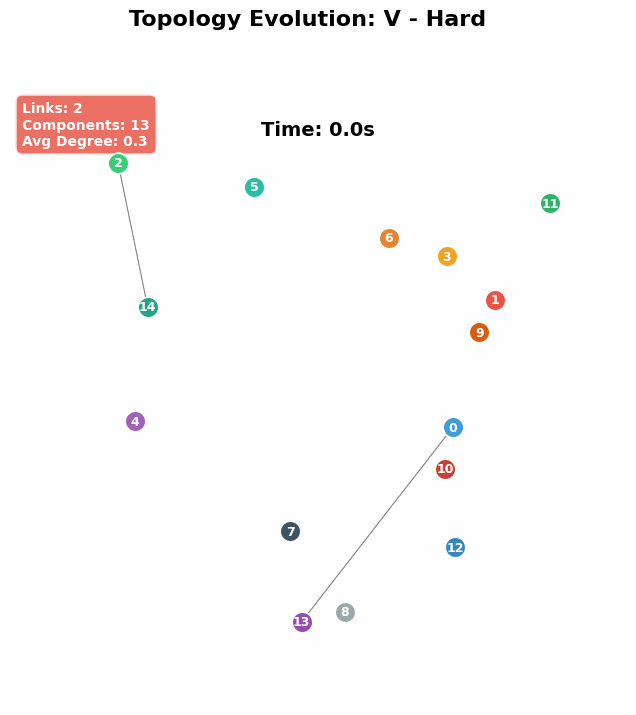

# 拓扑演化GIF动画

本目录包含网络拓扑演化的GIF动画文件，生动展示网络连接随时间的动态变化。

## 🎬 已生成的动画

### 示例动画（4个）

| 编队类型 | Easy模式 | Hard模式 |
|---------|----------|----------|
| **V-Formation** | v_formation_Easy_animation.gif<br>0.67 MB | v_formation_Hard_animation.gif<br>5.35 MB |
| **Line** | line_Easy_animation.gif<br>0.93 MB | line_Hard_animation.gif<br>2.58 MB |

### 动画规格

- **帧率**: 10-15 FPS
- **时长**: 20-30秒
- **分辨率**: 800×800像素
- **格式**: GIF动画（循环播放）
- **文件大小**: 0.5-5 MB

---

## 🎯 动画特点

### 视觉元素

#### 动态节点
- 🔵🔴🟢🟠🟣 **彩色圆圈**: 15个无人机节点
- **实时位置**: 根据GPS数据平滑移动
- **节点ID**: 白色数字标签（0-14）

#### 动态链路
- **黑色连线**: 实时显示活跃的通信链路
- **线条粗细**: Easy(粗) > Moderate(中) > Hard(细)
- **透明度变化**: 反映链路质量

#### 实时统计（左上角）
- **Links**: 当前活跃链路数量
- **Components**: 连通分量数
- **Avg Degree**: 平均节点度

#### 时间标签（顶部）
- **Time**: 显示当前仿真时间（秒）

#### 节点轨迹（可选）
- **彩色尾迹**: 显示节点最近10个位置
- **透明渐变**: 越旧的位置越透明

---

## 🔍 如何解读动画

### 观察网络稳定性

#### Easy模式（绿色背景）
- **预期表现**:
  - 链路稳定，很少断开
  - 节点移动平缳
  - Components始终为1
  - Links数量稳定在60-80

#### Hard模式（红色背景）
- **预期表现**:
  - 链路频繁闪烁（断开/重连）
  - 节点快速移动
  - Components在1-3之间变化
  - Links数量波动在20-40

### 识别关键事件

1. **网络分割事件**
   - Components突然从1变为2或更多
   - 部分节点失去连接
   - 可能出现孤立节点

2. **拓扑重构**
   - 大量链路同时变化
   - 网络结构突变
   - 可能由于编队调整

3. **链路抖动**
   - 某些链路快速闪烁
   - 表明该链路处于临界距离
   - 信号质量不稳定

---

## 💡 动画 vs 静态图

### 动画的优势

| 特性 | 静态图 | GIF动画 |
|------|--------|---------|
| **时间分辨率** | 10个离散时刻 | 200-450个连续帧 |
| **运动感知** | ❌ 无法感知 | ✅ 流畅展示 |
| **事件捕捉** | 可能错过 | 完整记录 |
| **趋势理解** | 需要想象 | 直观可见 |
| **文件大小** | ~200KB | 0.5-5MB |
| **观看体验** | 需要对比 | 自动播放 |

### 适用场景

**使用GIF动画**:
- 演示汇报（PPT、网页）
- 动态行为分析
- 问题诊断
- 教学展示

**使用静态图**:
- 论文印刷
- 详细对比
- 空间受限场合

---

## 🛠️ 生成更多动画

### 快速生成（所有数据集）

```bash
cd /mnt/e/Simulator/ns3/workspace/ns-allinone-3.43/ns-3.43/benchmark/bench_pic
python3 visualize_topology_animation.py
# 选择选项1
```

### 生成单个高质量动画

```python
from visualize_topology_animation import TopologyAnimationGenerator

generator = TopologyAnimationGenerator(benchmark_dir)

# 生成带轨迹的高质量动画
generator.generate_single_animation(
    dataset_name='cross_Hard',  # 数据集名称
    fps=20,                      # 帧率（更流畅）
    duration=40,                 # 时长（秒）
    show_trails=True            # 显示节点轨迹
)
```

### 参数调整建议

| 参数 | 建议范围 | 说明 |
|------|---------|------|
| **fps** | 10-30 | 越高越流畅，文件越大 |
| **duration** | 20-60 | 动画时长（秒） |
| **show_trails** | True/False | 是否显示节点轨迹 |

### 优化建议

**减小文件大小**:
```python
fps=8          # 降低帧率
duration=15    # 缩短时长
```

**提高质量**:
```python
fps=24         # 提高帧率
duration=45    # 延长时长
show_trails=True  # 添加轨迹
```

---

## 📊 技术细节

### 数据处理

1. **拓扑数据**: 从`topology-changes.txt`读取链路变化
2. **位置数据**: 从`node-positions.csv`读取节点坐标
3. **时间插值**: 平滑节点运动轨迹
4. **坐标归一化**: 映射到[0,1]范围

### 动画生成流程

```
数据解析 → 时间采样 → 逐帧渲染 → GIF合成
```

### 性能优化

- **内存管理**: 逐帧生成，避免内存溢出
- **文件压缩**: 使用PIL的optimize参数
- **并行处理**: 可扩展为多进程生成

---

## 🎨 视觉设计原理

### 色彩系统

- **节点颜色**: 15种高对比度颜色循环
- **背景色**: 根据难度（绿/橙/红）
- **链路色**: 黑色（经典网络图风格）

### 动画节奏

- **10 FPS**: 基础流畅度，适合观察
- **15 FPS**: 平衡流畅度和文件大小
- **20+ FPS**: 高质量，适合演示

### 信息密度

- **核心信息**: 拓扑结构
- **辅助信息**: 统计数据
- **可选信息**: 节点轨迹

---

## 📈 分析价值

### 可发现的模式

1. **周期性行为**: 链路周期性断开重连
2. **级联失效**: 一个链路断开导致连锁反应
3. **稳定核心**: 始终保持连接的节点组
4. **边缘游离**: 频繁进出网络的节点

### 量化指标

通过观察动画可估算：
- **链路生存期**: 连续存在的时间
- **拓扑变化率**: 每秒链路变化次数
- **网络分割频率**: Components > 1的时间比例

---

## 🚀 进阶应用

### 1. 转换为视频（MP4）

```python
# 使用 imageio 或 opencv
import imageio
reader = imageio.get_reader('animation.gif')
fps = reader.get_meta_data()['fps']
writer = imageio.get_writer('animation.mp4', fps=fps)
for frame in reader:
    writer.append_data(frame)
writer.close()
```

### 2. 嵌入网页

```html

```

### 3. 制作对比动画

并排放置Easy和Hard模式，同步播放对比差异。

---

## 📝 引用建议

在论文或报告中引用时：

> "Figure X shows the topology evolution animation of [formation] formation 
> under [difficulty] conditions, with [N] frames at [fps] FPS over [duration] seconds.
> The animation reveals [key observation]."

---

**生成时间**: 2025-10-12  
**工具版本**: Topology Animation Generator v1.0  
**Python依赖**: matplotlib, numpy, pandas, networkx, PIL  
**文件格式**: GIF89a (Animated GIF)
